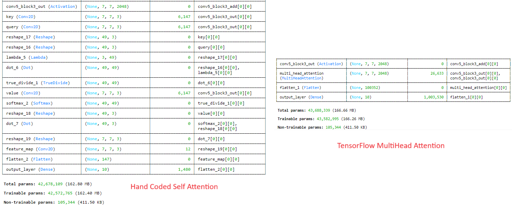

## Overview
This article would discuss the following concepts
> 1. Basic intuation of attention model
> 2. Mathematics behind the attention model
> 3. Implementation of attention mechanism
> 4. Use of Tensorflow ``tf.keras.layers.MultiHeadAttention`` API
> 5. Multi-Head Attention
Without further delay, lets deep dive into what is attention mechanism, why it is so popular?

## Basic intuation of attention model
Imagine you are reading a book, and you come across a character whose actions are essential to understand the current plot. To make sense of what's happening, you need to remember previous details about this character. Here’s how the attention mechanism works in this context: <br/>
<strong>Query:</strong> Think of the query as the question you're asking while reading. For example, "What has this character done before?" <br/>
<strong>Key:</strong> The key is like an index or a set of clues that help you find the right information in the book. It's the reference to different points in the story where this character is mentioned. <br/>
<strong>Value:</strong> The value is the actual information you need about the character, like their past actions and traits.

If we explain the same example in terms of python data types then it would be something similar to as described in the below example. The query is the question that we are looking for, key is the reference that can be ``mahabharata_characters`` and value would be the value of the query. So if we are looking for the character ``Ashwatthama`` then the ``mahabharata_characters`` would be the reference, treated as key and the value as ``The formidable warrior and son of Dronacharya, known for his unrelenting pursuit of revenge against the Pandavas``.

```python:title=Dictionary.py
# dictionary of characters and their description
mahabharata_characters = {
    "Arjuna": "The peerless archer, whose valor and skill were unmatched on the battlefield of Kurukshetra",
    "Krishna": "The divine charioteer and guide to Arjuna, whose wisdom and counsel in the Bhagavad Gita are legendary.",
    "Bhishma": "The grand patriarch of the Kuru dynasty, renowned for his vow of celibacy and unparalleled warrior prowess.",
    "Draupadi": "The fiery princess and wife of the Pandavas, whose dignity and strength became a rallying point in their quest for justice.",
    "Karna": "The tragic hero and unparalleled warrior, known for his unwavering loyalty to Duryodhana and his inner conflict regarding his true lineage."
    "Ashwatthama": "The formidable warrior and son of Dronacharya, known for his unrelenting pursuit of revenge against the Pandavas."
}
```
Build upon this intuation, attention mechanism keeps the track of long sequences and give more weightsage to only certain portion who are useful for the token.

## Mathematics behind the attention model
If we see the architecture proposed in the paper[^1], it has the following component ``Scale``, ``Mask (Opt)``, ``Softmax`` and ``matmul``. These are expressed in the hand written notes.

The scaling or normalization is performed as if the value of dk become a large number, then the dot products grow large in magnitude, pushing the softmax function into regions where it has extremely small gradients. To counteract this effect, we scale the dot products by ``1/sqrt(dk)`` [^1]. The mask operation is optional, this one is used, in sequence to sequence generation or similar application. When the objective of the model is to predict the next token (word), and the input feature is the collection of previous words and the next word. If we want to mask the future token, in that situation we can use this masking operation. This sets the upper tringular matrix of the dot product between query and key to infinte and when we apply softmax on top of this, the upper tringular matrix is set to zero. This we do to make the sum equal to 1. For more reference, follow this video [^2]. 


## Implementation of attention mechanism
This section is the implementation of the above section in Tensorflow, I have taken reference from Professor Mubarak Shah Lecture, you can visit for more details [^3].
```python:title=attention_model.py
input_shape = (224, 224, 3)  # Assuming a 3-channel (RGB) image

# Define the input layer
inputs = tf.keras.Input(shape=input_shape)

# Add a pre-trained ResNet50 layer (excluding the top classification layer)
resnet50_base = applications.ResNet50(include_top=False, weights='imagenet', input_tensor=inputs)

# number of filters
dq = dk = dv =3
feature_dimension = (resnet50_base.output_shape[1], resnet50_base.output_shape[2], dk)
print("Output feature dimension:",feature_dimension)

# Add a 1x1 convolutional layer to get the query
query = layers.Conv2D(filters=dq, kernel_size=(1, 1), activation='relu', padding='same', name="query")(resnet50_base.output)
print("Query output shape:", query.shape)

# Add a 1x1 convolutional layer to get the key
key = layers.Conv2D(filters=dk, kernel_size=(1, 1), activation='relu', padding='same', name="key")(resnet50_base.output)
print("Key output shape:", key.shape)

# Add a 1x1 convolutional layer to get the value
value = layers.Conv2D(filters=dv, kernel_size=(1, 1), activation='relu', padding='same', name="value")(resnet50_base.output)
print("Value output shape:", value.shape)

# Flatten the conv_layer to a 2D tensor
flattened_query = layers.Reshape((-1, 3))(query)
flattened_key = layers.Reshape((-1, 3))(key)
flattened_value = layers.Reshape((-1, 3))(value)

print("Flattened Query shape:", flattened_query.shape)
print("Flattened Key shape:", flattened_key.shape)
print("Flattened Value shape:", flattened_value.shape)

# Transpose the flattened_key
transposed_key = layers.Lambda(lambda x: tf.transpose(x, perm=[0, 2, 1]))(flattened_key)

# Print the shape of the transposed_key
print("Transposed Key shape:", transposed_key.shape)

# Compute the dot product between the query and the key and scale it
scaled_prod = layers.Dot(axes=(2,1))([flattened_query, transposed_key]) / tf.math.sqrt(tf.cast(dk, tf.float32))
print("Dot Product shape:", prod.shape)

# Apply softmax to the attention scores
softmax_layer = layers.Softmax()(scaled_prod)
print("Softmax shape:", softmax_layer.shape)

# Compute the attention-weighted value
attention_output = layers.Dot(axes=1)([softmax_layer, flattened_value])
print("Attention Output shape:", attention_output.shape)

reshaped_attention_output = layers.Reshape((feature_dimension))(attention_output)


# # Reshape the attention output to match the original image dimensions
# reshaped_attention_output = layers.Reshape((32, 32, 3))(attention_output)
print("Reshaped Attention Output shape:", reshaped_attention_output.shape)

# Apply a 1x1 convolutional layer to the attention output
self_attended_feature = layers.Conv2D(filters=3, kernel_size=(1, 1), activation='relu', padding='same', 
                                      name="feature_map")(reshaped_attention_output)
print("Self-attended Feature shape:", self_attended_feature.shape)
```

## Use of Tensorflow ``tf.keras.layers.MultiHeadAttention`` API
If you are using Tensoflow then, you may use ``tf.keras.layers.MultiHeadAttention`` this API to use the multihead attention directly. If ``query``, ``key``, ``value`` are the same, then this is self-attention [^4]. Each timestep in query attends to the corresponding sequence in ``key``, and returns a fixed-width vector.

This layer first projects ``query``, ``key`` and ``value``. These are (effectively) a list of tensors of length ``num_attention_heads``, where the corresponding shapes are (``batch_size``, ``<query dimensions>``, ``key_dim``), (``batch_size``, ``<key/value dimensions>``, ``key_dim``), (``batch_size``, ``<key/value dimensions>``, ``value_dim``).

Then, the query and key tensors are dot-producted and scaled. These are softmaxed to obtain attention probabilities. The value tensors are then interpolated by these probabilities, then concatenated back to a single tensor. Finally, the result tensor with the last dimension as value_dim can take a linear projection and return.

```python:title=multihead_attention_model.py
self_attended_feature = layers.MultiHeadAttention(num_heads=1, key_dim=3, value_dim = 3)(resnet50_base.output, resnet50_base.output)
```

The comparison between both the models can be seen in the below figure.

## Multi Head Attention
When the number of head is one and the query, key and value dimensions are same then same network becomes self attention. But when we use multiple heads then the same network (key, query and value) gets multiplied with the number of heads and produce those many feature maps. Let's take the same example and extend it for the multiple heads. 


## References
[^1]: Vaswani, A., Shazeer, N., Parmar, N., Uszkoreit, J., Jones, L., Gomez, A. N., ... & Polosukhin, I. (2017). Attention is all you need. Advances in neural information processing systems, 30.
[^2]: https://www.youtube.com/watch?v=mmzRYGCfTzc
[^3]: https://www.youtube.com/watch?v=WyuZvGt7RY4&t=2207s
[^4]: https://www.tensorflow.org/api_docs/python/tf/keras/layers/MultiHeadAttention


