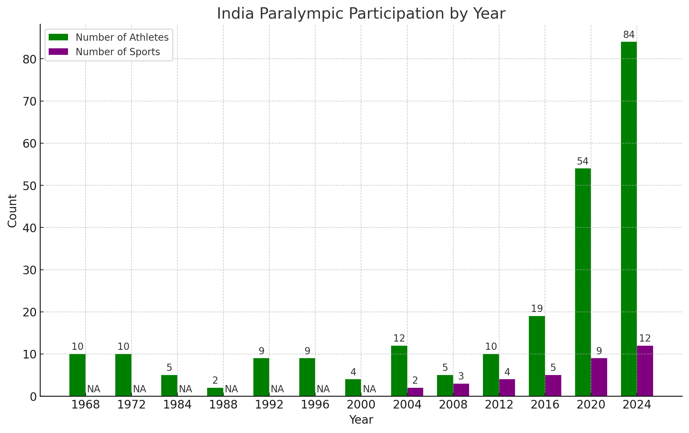
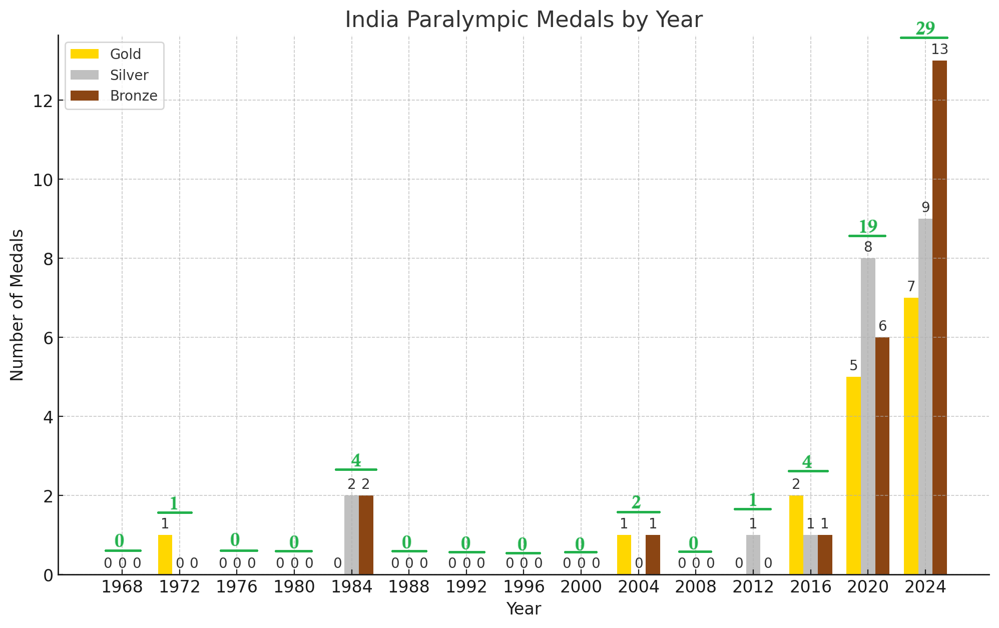

## Overview
The 17th edition of the Paralympics has concluded, with India finishing in 18th place and securing 29 medals: 7 gold, 9 silver, and 13 bronze[^1]. As a data enthusiast, I delved into India's Paralympic history to understand its journey.

The Paralympics began in 1960, and India made its debut in 1968 with 10 athletes. India’s first medal came in 1972 when Murlikant Petkar won gold in swimming. He was later honored with the Padma Shri, and his story was recently highlighted in the film Chandu Champion. India’s participation was interrupted during the emergency period from 1975 to 1977 but resumed in 1984 and has continued since.

This year, India had 84 athletes competing in 12 sports, achieving a notable success with 29 medals. The detailed participation and distribution across various sports are shown in the accompanying graph.

Congratulations to all the athletes, their families, coaches, and supporters. Their stories are a testament to resilience and inspire us to replace `refusal` with `attempt`, `competition` with `collaboration`, and `excuses` with `courage`.

There are few numbers that may be interesting for you.
> 1. India has participated so far in 13 out of 17 Paralympic editions.
> 2. Of these 13 editions, India failed to win any medals in 6.
> 3. As a result, the 60 medals India has won so far have come from just 7 editions.
> 4. The lowest athlete representation was in 1988 (2 athletes), 2000 (4 athletes), and 1984 & 2008 (5 athletes each).
> 5. The highest number of medals and participants for India occurred in this year’s Paralympics.
> 6. The lower medal count in some editions can be attributed to the lower number of participants.

The graph below shows India's participation and the number of sports they competed in. Data on sports participation from 1968 to 2000 is unavailable, so these values are marked as "NA."

The figure below illustrates India's medal tally in the Paralympics since 1968. India did not participate in the 1976 and 1988 games, so their representation is marked as 0, along with the years where India participated but did not win any medals. The breakdown of the medals is shown in different colors, with the total number of medals for each year displayed in green at the top.

## References
[^1]: https://en.wikipedia.org/wiki/India_at_the_Paralympics

