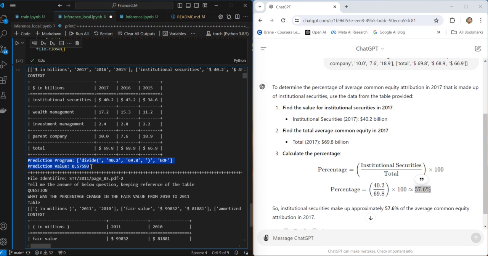

## Overview
💡I was recently working on an LLM assignment, the problem statement was to train one of the LLM models on Financial data (mostly tables) to seek answers of the mathematical questions. 🧠

I came across a research paper and discovered that LLMs are good in language pattern matching. But when it comes to imitation of complex reasoning abilities like human beings, their performance suffers. 

📊With this intent, I used FinQA dataset[^1] (Question Answering on Financial Report) to conduct experiment around that. I compared few of the results of BERT model trained on FinQA with ChatGPT. Results can be seen in the video 🤖

🔍Given a tricky scenario where I ask the question and given partial table to ChatGPT to answer, the finding was interesting.📉

For code and experiment you can visit the Github repository

https://github.com/dravinash/FinanceLLM

The live implementation can be seen in the below video.

*A detailed document can be seen here.*
[document](https://github.com/dravinash/FinanceLLM/blob/main/document/FinanceLLM.pdf)

## References
[^1]: Chen, Z., Chen, W., Smiley, C., Shah, S., Borova, I., Langdon, D., ... & Wang, W. Y. (2021). Finqa: A dataset of numerical reasoning over financial data. arXiv preprint arXiv:2109.00122.
