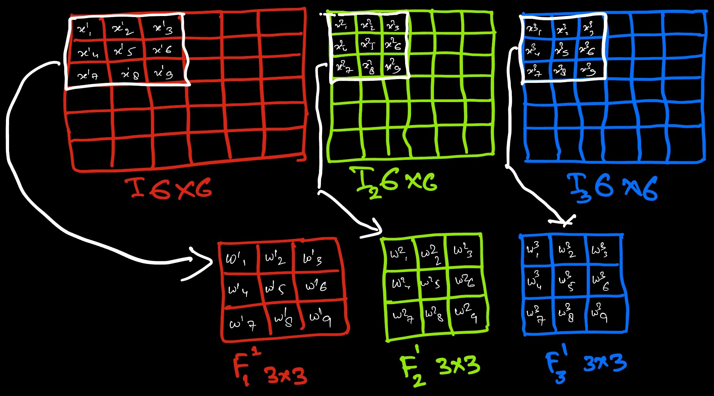
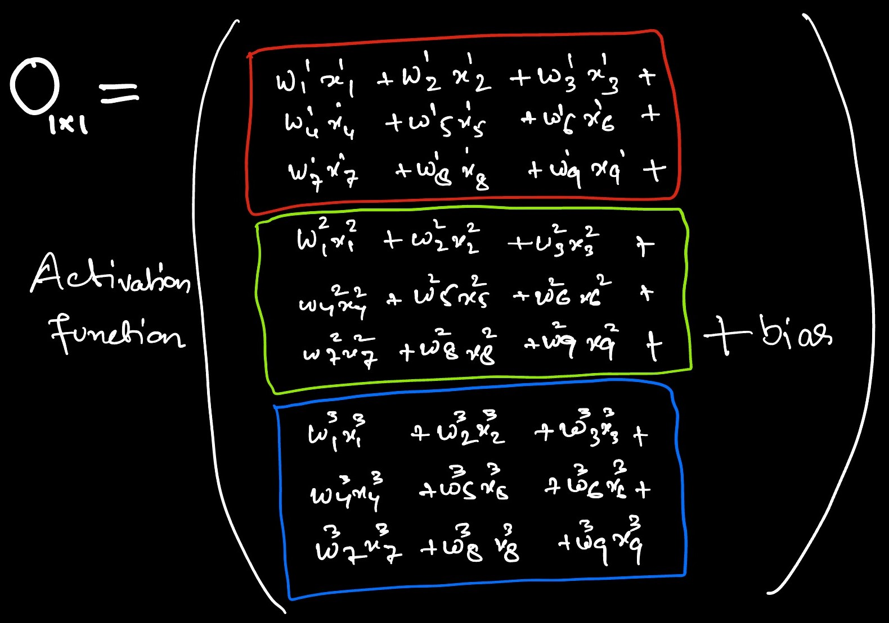
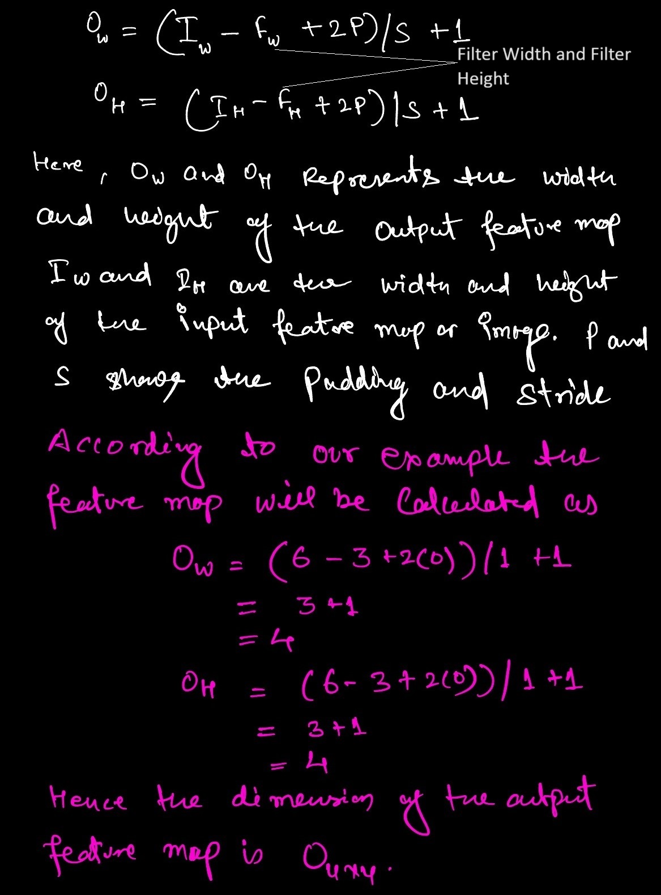
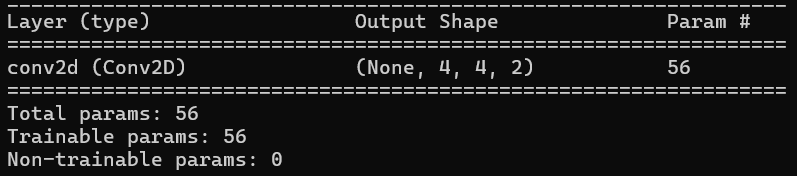
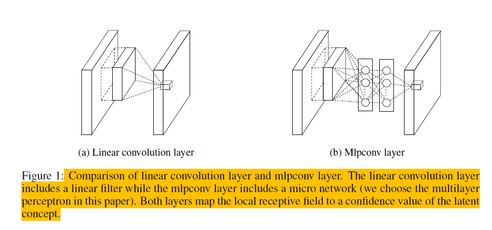
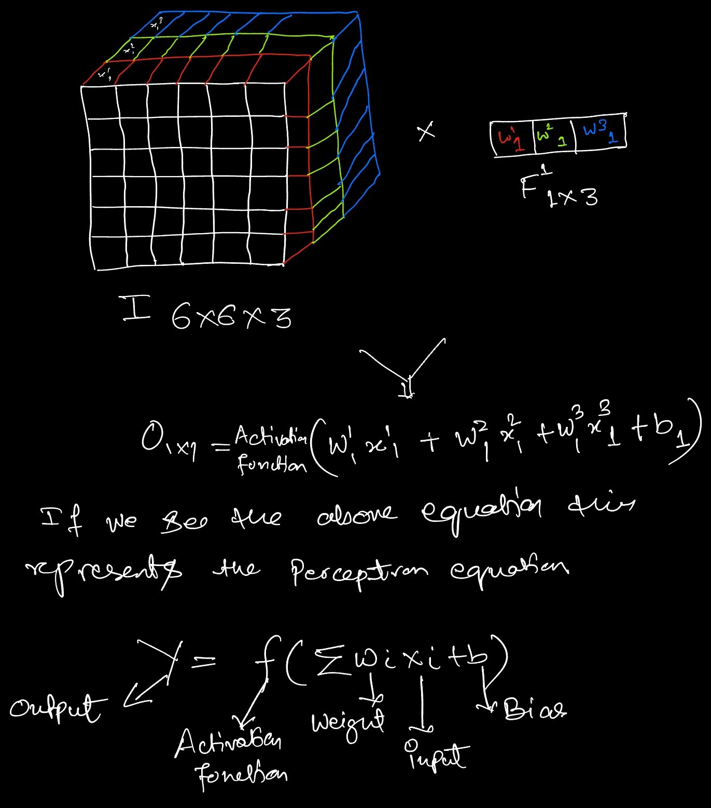
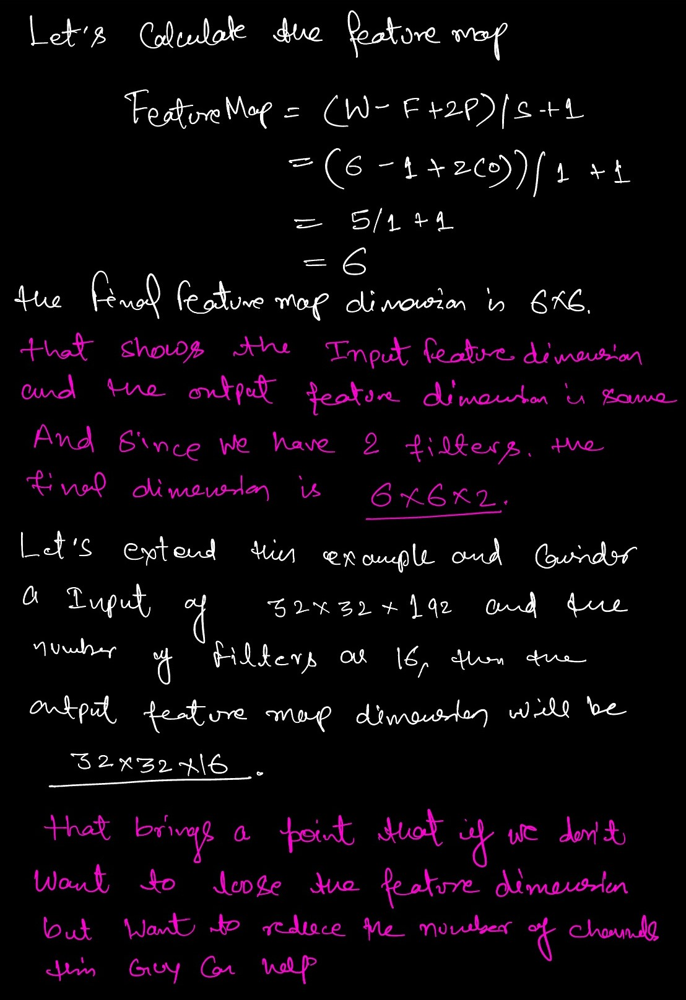

## Overview
Recently, while diving into the Self-Attention Model applied to images, I came across the term `1x1 convolutions`. At first, it sounded amusing, but as I dug deeper to understand it, I was thoroughly impressed. To make sense of this concept, I crafted a three-step process: <font color='#64ffda'>what is a 1x1 convolution</font>, <font color='#64ffda'>how it works</font>, <font color='#64ffda'>math behind this</font> and <font color='#64ffda'>why it's useful</font>.

## Some Background on Convolution Operation
To understand the 1x1 convolution, we first need to grasp the convolution operation and the complexity involved in the underlying process[^1]. Consider an RGB image with dimensions 6x6x3, and we want to apply a convolution layer with a filter size of 3x3, with 2 filters, and a ReLU activation function. Let's denote the output by 'O'. The mathematical representation for this operation is given below. Here, 'F' represents the filter, the superscript indicates the filter number, and the subscript denotes the input channel.




Let's validate these numbers such as output feature map dimension and the number of learning parameter by implementing the same example in tensorflow.

```python:title=Conv2D.py
import tensorflow as tf
from tensorflow.keras.models import Sequential
from tensorflow.keras.layers import Conv2D

# Define the model
model = Sequential()

# Add a 2D convolution layer
model.add(Conv2D(filters=2, kernel_size=(3, 3), activation='relu', input_shape=(6, 6, 3)))

# Summary of the model
model.summary()
```

The output of the network is displayed below.


## What is 1x1 convolution
This concept was proposed by Min Lin et al. in 2013 in the paper **Network in Network**[^2]. The idea was to use an MLP (Multi-Layer Perceptron) layer to introduce non-linearity into the network. The figure below illustrates the difference between a standard convolution layer and an MLP layer. The 1x1 convolution goes by various names, including Network in Network, MLP Conv, and Bottleneck layer in Inception[^3].
 Source: Page 2, Netowrk in Network (https://arxiv.org/pdf/1312.4400)

Let's take the same example that we have taken intially in our discussion, but keep the filter size to (1x1) and now compute the feature map, number of learning parameters to understand this better.



Let's examine the learning parameters for the first and second examples. For the first example, the calculation is `(1x1x3+1)*2`, because the filter size is 1x1 with 3 channels, resulting in a total of 8 learning parameters. In contrast, with a 3x3 convolution, the number of learning parameters is 56. This demonstrates how 1x1 convolutions help reduce computational complexity. Now, let's highlight some of the advantages of using 1x1 convolutions.

## Advantages of 1x1 Convolution
> 1. Reduces the number of channels
Using 1x1 convolutions helps reduce the number of channels without affecting the feature map. If we want to reduce the spatial dimensions of the feature map, a pooling layer would suffice. However, to reduce the number of channels, 1x1 convolutions are the way to go. A great example of this complexity reduction is explained by Andrew Yan-Tak Ng in the referenced video[^4]
> 2. Reduces Complexity
As seen in the above example, the number of trainable parameters for a 3x3 convolution is 56, while for a 1x1 convolution, it is 8. This demonstrates how significantly 1x1 convolutions reduce the complexity of the neural network.
> 3. Adding non-linarity
We know that non-linearity introduced through activation functions enhances learning and aids in latent feature representation. The 1x1 convolution operation helps increase this non-linearity. For example, in the case of 3x3 and 1x1 convolutions, the non-linear functions are applied 16 and 36 times, respectively. This demonstrates how 1x1 convolutions can be advantageous in such scenarios.

## References
[^1]: A good tutorial on CNN, https://cs231n.github.io/convolutional-networks
[^2]: Lin, M., Chen, Q., & Yan, S. (2013). Network in network. arXiv preprint arXiv:1312.4400.
[^3]: Szegedy, C., Liu, W., Jia, Y., Sermanet, P., Reed, S., Anguelov, D., ... & Rabinovich, A. (2015). Going deeper with convolutions. In Proceedings of the IEEE conference on computer vision and pattern recognition (pp. 1-9).
[^4]: 1x1 in Inception Netoerk, https://youtu.be/C86ZXvgpejM?si=z-farl2kDcZcRxEv
