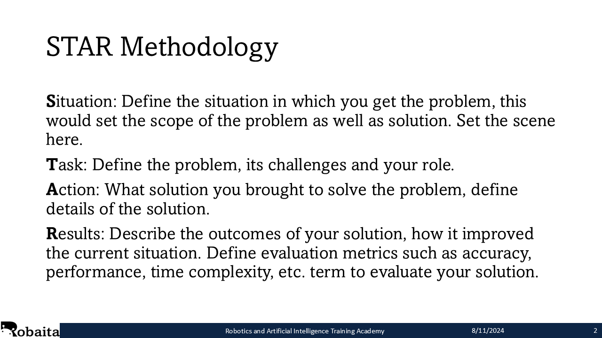
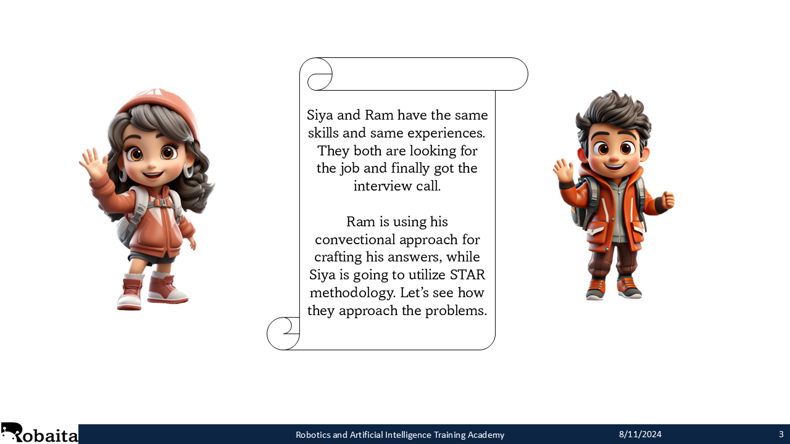
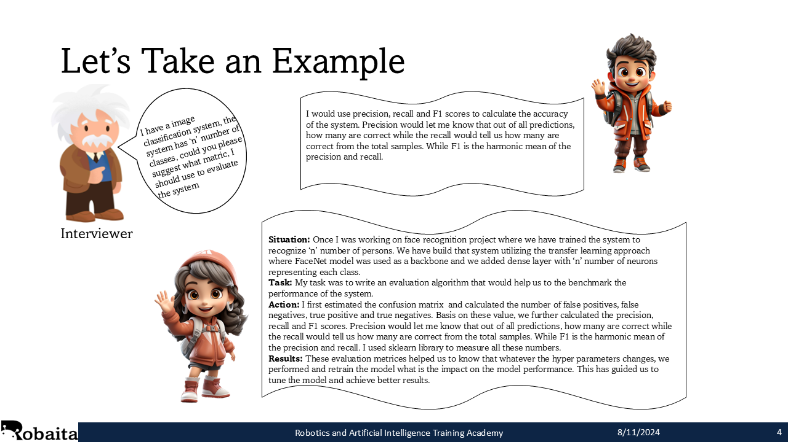
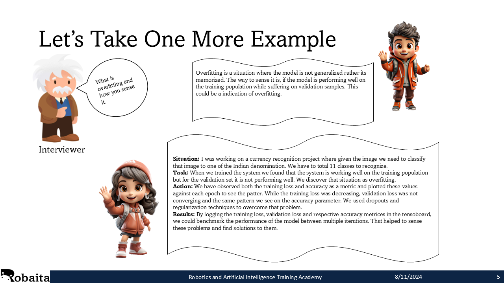
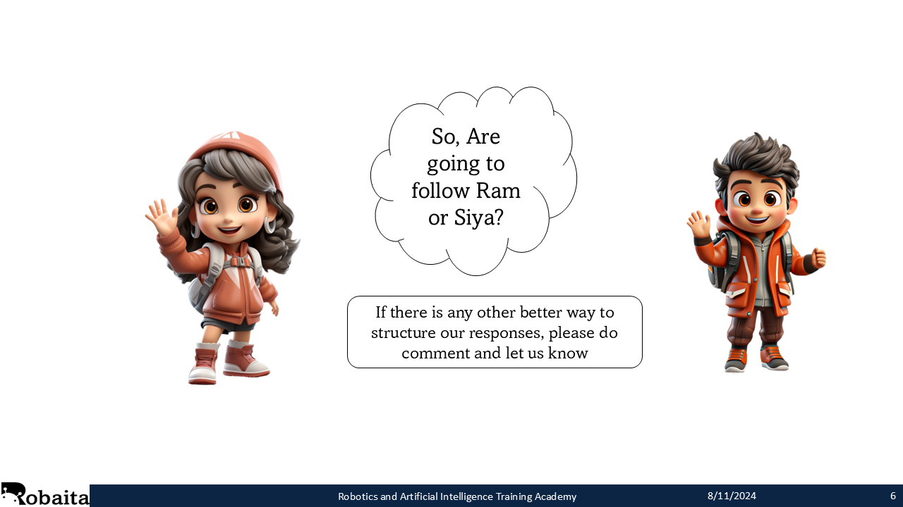

## Overview
STAR methodoloy is an approach about how you can structure your responces [^1]. STAR stands for Situation, Task, Action and Results. While making your responce, you can break the responce into four segments and then make a story around them. This would give a complete idea about in what situation, what problem you faced and how you overcome that by making a solution and at the end how the solution held you to get our from that situation. [^2]  
STAR is used mainly in the behavioural interview but I believe that it could be used for the technical interviews as well [^3]. As it would give the complte idea about your work and descibe your role and contributions. 

## References
[^1]: https://in.indeed.com/career-advice/interviewing/how-to-use-the-star-interview-response-technique#:~:text=STAR%20stands%20for%3A%20situation%2C%20task,right%20fit%20for%20a%20job.
[^2]: https://www.themuse.com/advice/star-interview-method
[^3]: https://www.vawizard.org/wiz-pdf/STAR_Method_Interviews.pdf
